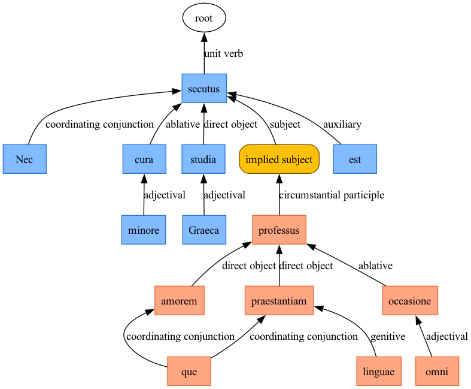
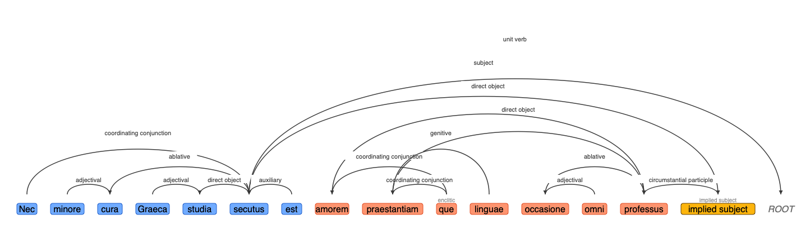

# arsgrammatica

> A python package leveraging LLMs with [dspy](https://dspy.ai) to analyze the syntax of passages of Latin..

`arsgrammatica` offers an alternative analytic scheme to [Universal Dependencies](https://universaldependencies.org), designed to describe Latin syntax in familiar terms that are convenient for research and teaching. Released under the [GNU General Public License v3 or later](LICENSE). 

- [Documentation](https://neelsmith.github.io/arsgrammatica/).
- See [release history](https://github.com/neelsmith/arsgrammatica/blob/main/releases.md).
- See the [project issue tracker](https://github.com/neelsmith/arsgrammatica/issues) for known gaps and work in progress.

## Visualizations

The `arsgrammatica` package includes numerous utilities for visualizing syntactic relations.

## Related work

Parallel python packages for language-specific syntactic analysis:

- [grammatike](https://github.com/neelsmith/grammatike) for Ancient Greek
- [diqduq](https://github.com/neelsmith/diqduq) for Biblical Hebrew

Packages for working with universal syntax models:

- [aat](https://github.com/neelsmith/aat), a Python package implementing a reduced model of natural-language syntax, Agent-Action-Target
- [udsyntax](https://github.com/neelsmith/udsyntax), a Python package to get dependency data from spaCy into a simple syntax graph format

Using syntax from `arsgrammatica` for contextual disambiguation of morphological analyses:

- [tabulaedspy](https://github.com/neelsmith/tabulaedspy): a Python package adding disambiguated morphological analyses to `arsgrammatica` tokens.

See [more of my current projects](https://neelsmith.github.io/projects/).