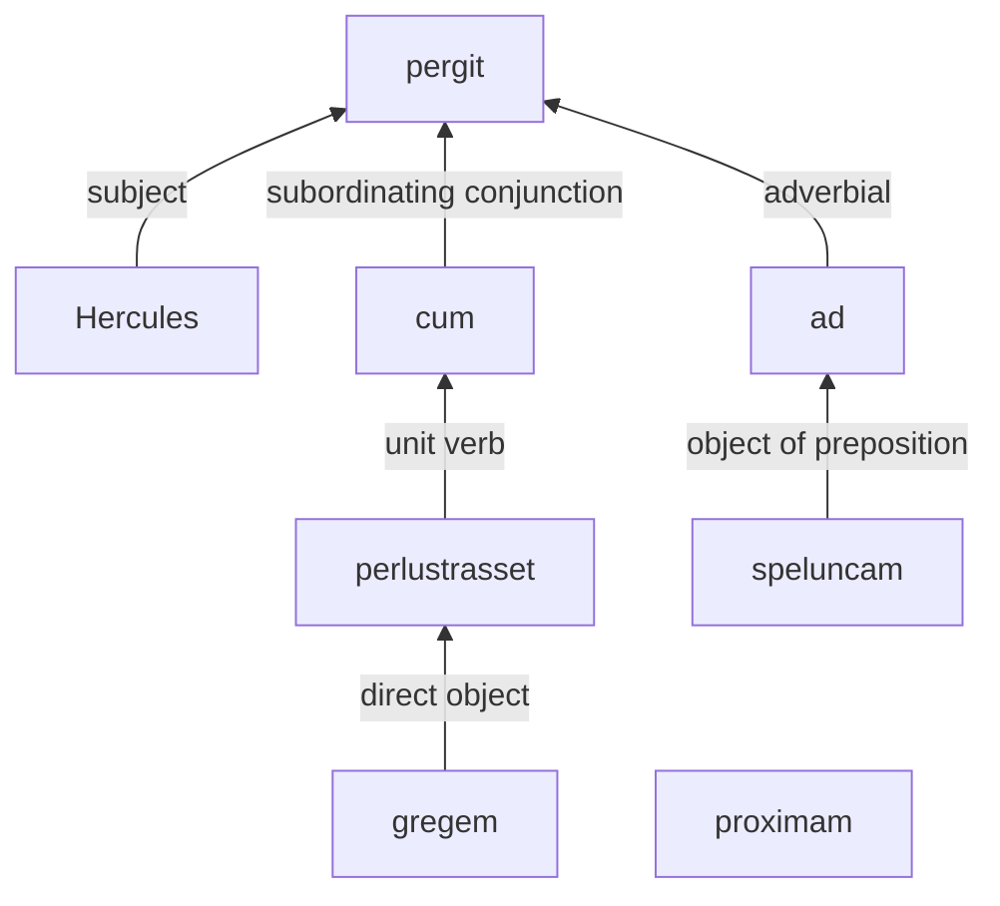

```mermaid
graph BT
    t0["Hercules"]
    t1["cum"]
    t2["gregem"]
    t3["perlustrasset"]
    t5["pergit"]
    t6["ad"]
    t7["proximam"]
    t8["speluncam"]
    t0 -->|subject| t5
    t1 -->|subordinating conjunction| t5
    t2 -->|direct object| t3
    t3 -->|unit verb| t1
    t6 -->|adverbial| t5
    t8 -->|object of preposition| t6
```