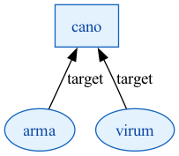

Agent-Action-Target is a *universal* syntactic model, but it takes a very different approach from the [Universal Dependency scheme](./ud.qmd). Instead of trying to map 

- semantically compatible
- reduced syntax model
- x-lingual comparison

## A simple example

Consider a very short Latin sentence, and a visualization of the dependency graphs that AAT annotation and `arsgrammatica` build for it.

> *arma virumque cano.*

:::: {.columns}

::: {.column width="45%"}
### AAT 

  
:::

::: {.column width="55%"}
### `arsgrammatica` 
  
:::

::::

:::: {.columns}

::: {.column width="45%"}
### AAT 

  
:::

::: {.column width="55%"}
### `arsgrammatica` in AAT
  
:::

::::