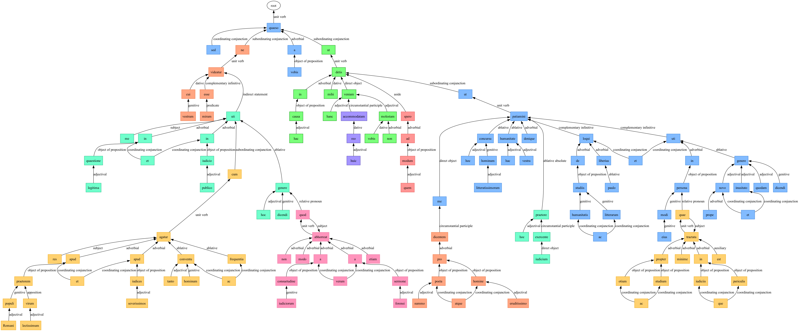

> sed ne cui vestrum mirum esse videatur, me in quaestione legitima et in iudicio publico, cum res agatur apud praetorem populi Romani, lectissimum virum, et apud severissimos iudices, tanto conventu hominum ac frequentia hoc uti genere dicendi quod non modo a consuetudine iudiciorum verum etiam a forensi sermone abhorreat, quaeso a vobis ut in hac causa mihi detis hanc veniam accommodatam huic reo, vobis, quem ad modum spero, non molestam, ut me pro summo poeta atque eruditissimo homine dicentem hoc concursu hominum litteratissimorum, hac vestra humanitate, hoc denique praetore exercente iudicium, patiamini de studiis humanitatis ac litterarum paulo loqui liberius, et in eius modi persona quae propter otium ac studium minime in iudiciis periculis que tractata est uti prope novo quodam et inusitato genere dicendi.

::: {.callout-note collapse="true"}
### Expland to see table of tokens
*TBA*
:::
