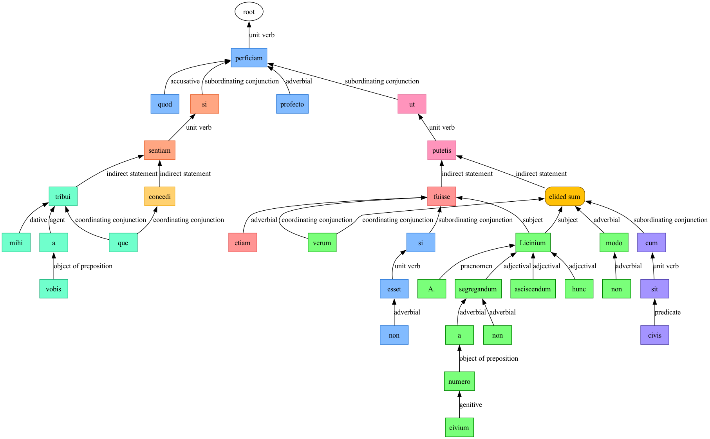

> quod si mihi a vobis tribui concedique sentiam, perficiam profecto ut hunc A. Licinium non modo non segregandum, cum sit civis, a numero civium verum etiam, si non esset, putetis asciscendum fuisse.

::: {.callout-note collapse="true"}
### Expland to see table of tokens
*TBA*
:::