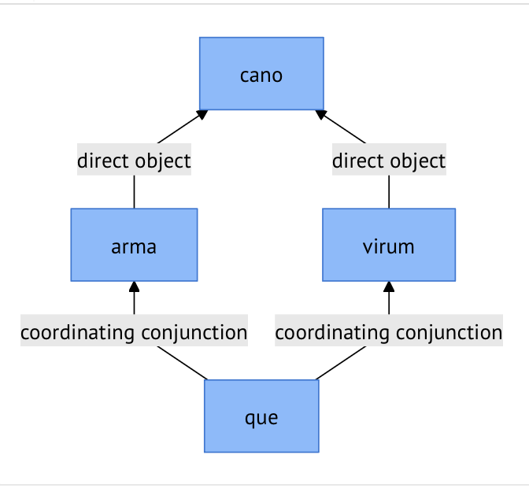

## Key features of `arsgrammatica`'s syntax model

- designed for study of Latin texts (for research or teaching)  using familiar terminology
- tokenizes and classifies tokens from strings of text
- organizes syntactic analysis in coordinated and subordinated *verbal expressions*, subject-verb-object expressions generally corresponding to clauses in an English translation
- relates all *lexical* tokens to other tokens in a dependency graph following a defined scheme
- tokens are uniquely citable within uniquely citable passages of text

## Relation to other models

Different models of syntax serve different purposes.

- Relation to Universal Dependencies (UD) *TBA*
- Relation to Agent-Action-Target (AAT) *TBA*

 

