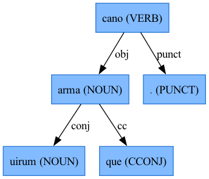

## Universal Dependencies

The [Universal Dependencies framework](https://universaldependencies.org) (UD) proposes annotation schemes for parts of speech, morphological features, and syntactic dependencies to apply across many languages, that have already been applied to more than 150 languages. UD is especially significant to Latinists because of Patrick Burns' work on [LatinCy](https://latincy.github.io/latincy-book/), language models that work with the Python spaCy package for natural-language processing. Each token analyzed with spaCy has a `head` property linking it to another token in the syntax graph, and a `dep_` property with the UD annotation for syntactic relationship (dependency).

::: {.callout-tip}
## The `udsyntax` package

spaCy's annotations for each analyzed token are extensive, but include many elements that are not helpful for Latinists (e.g., `like_email`, `like_url`). You can extract the syntactic relations from spaCy's tokens into a simple syntactic graph structure with the [udsyntax](https://neelsmith.github.io/udsyntax/) package.
:::

## A simple illustration

Consider a very short Latin sentence, and a visualization of the dependency graphs that UD annotation and `arsgrammatica` build for it.

> *arma virumque cano.*

| UD | `arsgrammatica` |
| --- | --- |
|  | 
 |

Several features of the UD graph will seem odd to a Latinist. The UD has only one direct object (tagged `obj`) of the verb token *cano*. The noun *uirum* is tagged as a dependency of *arma*, in the relation tagged *conj*. The conjunction *que* is not related to *virum* but is a dependency of *arma*. The terminal period appears as part of the syntactic analysis.

`arsgrammatica`'s Latin-focused graph is a more natural representation for *research* questions like "What are the direct objects in this sentence?" In Latin *classrooms*, many teachers may find the UD representation unusuable or simply "wrong." `arsgrammatica`'s representation more closely follows what students will find in Latin textbooks.

## Two graph-theoretic details

1. The UD guidelines guarantee that all syntax graphs are *trees*. As this example shows, that is not true for `arsgrammatica`'s directed graphs. In fact, although `arsgrammatica`'s syntax graphs often approximate a tree structure, they are not guaranteed to be *acyclic* either: elements like relative pronouns have relations both to their antecedent and to their function in the relative clause, which can set up cycles. (See examples with relative pronouns in the documentation.)

2. UD graphs are oriented with relations from root-level verbal structures flowing *down*; `arsgrammatica` graphs are oriented so that related elements from *up* to root-level verbal structures.
