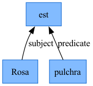
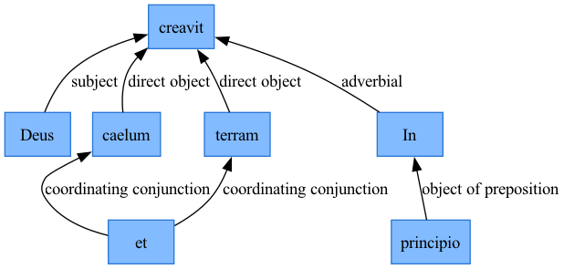
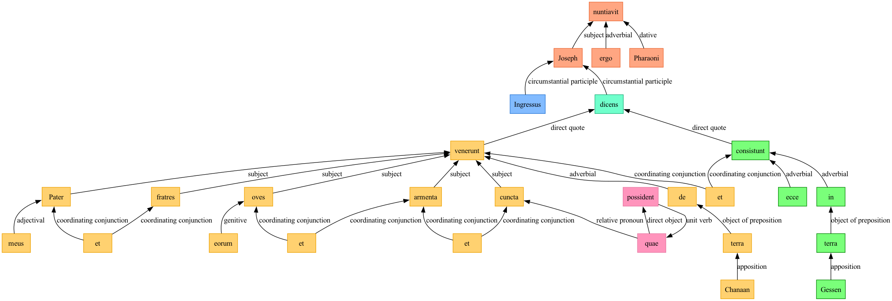

Once we have [analyzed a passage](./analysis.qmd), we can use graph metrics to characterize the resulting syntax graph with Python's NetworkX package. `arsgrammatica` includes functions for analyzing graphs from Python, and a Marimo notebook, `latin_syntaxer_graphs.py`, where you can interactively explore some of these metrics.


First we create a NetworkX graph from a token graph with the `tokengraph_to_networkx` function.

```python
from arsgrammatica import tokengraph_to_networkx, graph_metrics
nxgraph, warnings = tokengraph_to_networkx(tokengraph)
```

`arsgrammatica` has a `graph_metrics` function that computes several standard measurements that can help us understand the size, complexity, and "shape" of the syntax analysis' graph structure.

```python
metrics = graph_metrics(nxgraph)
```


## Size and complexity of a graph


- `node_count`/`edge_count` -- tokens (excluding punctuation) and relations between them.

- `is_acyclic`/`longest_chain` -- whether the graph is a DAG (it always should be for a well-formed analysis; a cycle means something is malformed, mirroring `compute_subordination_depths()`'s own cycle-detection warning) and, if so, the length in edges of its longest directed path -- the deepest raw token-to-token embedding chain in the sentence. `longest_chain` is `None` when a cycle makes it undefined, or the graph is empty.


## "Shape" (topology)

- `cyclomatic_number` -- edges beyond a spanning tree (`edge_count - node_count + weakly_connected_components`). `0` for a pure tree; each coordinating conjunction, apposition, or similar construction that gives a token a second governor/dependent beyond strict tree shape adds `1`. A direct, single-number answer to "how much non-tree structure does this sentence have".

- `leaf_count`/`leaf_fraction` -- tokens with no dependents of their own (in-degree 0), i.e. terminal tokens in the dependency structure.
- `mean_dependents`/`max_dependents` -- the in-degree distribution's mean and max: how many other tokens point at the typical/busiest token. A sentence with a high max relative to its node count reads as "one token governs almost everything"; a low, even mean/max reads as "shallow and bushy" rather than "deep and chainy".
- `relationship_counts` -- how many edges carry each relationship label (e.g. `{"subject": 2, "direct object": 1, ...}`) -- what KIND of structure the sentence leans on, not just how much of it there is.

All fields are `0`/`0.0`/empty (never raised) for an empty graph, or a tokengraph that's all punctuation -- see "Degrades visibly, never raises" below.


## Worked example

| metric| Example | *Genesis* 1.1| *Genesis* 47.1 | 
| --- | ---| --- | --- |
| node count | 3 | 7 | 54 |
| edge count | 2 | 7 | 59 |
| cyclomatic number | 0 | 1 | 8 |
| longest chain | 1 | 2 | - |
| leaf count | 2 | 3 | 21 |
| leaf fraction | 67% | 43% | 39% |
| mean dependents | 0.67 | 1.0 | 4 |
| max dependents | 2 | 1.09| 7 |

> Rosa pulchra est.



> In principio creavit Deus caelum et terram.




> Ingressus ergo Joseph nuntiavit Pharaoni, dicens: Pater meus et fratres, oves eorum et armenta, et cuncta quae possident, venerunt de terra Chanaan: et ecce consistunt in terra Gessen.




```
metrics.relationship_counts
{'circumstantial participle': 2, 'adverbial': 6, 'subject': 8, 'dative': 1, 'adjectival': 6, 'coordinating conjunction': 12, 'genitive': 4, 'relative pronoun': 2, 'direct object': 4, 'unit verb': 2, 'direct quote': 4, 'object of preposition': 3, 'apposition': 4, 'predicate': 1}
```

```
metricsgen1.relationship_counts
{'adverbial': 1, 'object of preposition': 1, 'subject': 1, 'direct object': 2, 'coordinating conjunction': 2}
```


## Edge orientation: in-degree is "how many dependents"

An edge always points FROM a token TO the token *it* relates to -- e.g. a subject noun's edge points at its verb -- the same direction Mermaid draws its arrows in. So a token with many dependents (an independent verb, which every one of its clause's arguments and modifiers ultimately points toward) has high **in**-degree, not high out-degree; a leaf token with no dependents of its own has in-degree 0. Every "dependent"/"leaf" metric below is built entirely around this in-degree-as-branching convention -- it's easy to reach for out-degree instead when reading `graph_metrics()`'s numbers, and get the opposite of the intended reading.

## Most tokengraphs are nearly trees

Most tokengraphs are very nearly out-trees rooted at whichever token(s) have `relatedtoken1 == "root"` (that sentinel is never a real node, so a root token simply has no outgoing edge at all) -- the same rooted structure `verbal_units.compute_subordination_depths()` already assumes. The handful of constructions that make a tokengraph more than a tree -- a coordinating conjunction's `relatedtoken1` AND `relatedtoken2` both pointing at the pair it joins, an apposition's second noun pointing back at the first, and similar overflow uses of `relatedtoken2` -- are exactly what `cyclomatic_number` (below) counts.


## Worked example: a plain chain vs. a coordinating conjunction

"bona puella venit" ("the good girl comes") is a plain 3-token dependency chain -- `bona` -> `puella` -> `venit` -- with no coordination or other overflow edges, so it reads as a pure tree: `cyclomatic_number` 0, one leaf (`bona`, since nothing points at an adjective), `longest_chain` 2 (two edges from the leaf to the root verb).

"Arma virumque cano" ("I sing of arms and the man") is different: `que` coordinates `Arma` and `virum`, each of which is a direct object of `cano`. The coordinating conjunction's own two out-edges (`relatedtoken1` -> `Arma`, `relatedtoken2` -> `virum`) are the one construction in this scheme that genuinely makes a token's structure more than a tree, so this reads as `cyclomatic_number` 1 (one edge beyond a 3-edge spanning tree of 4 nodes), and `cano` shows `max_dependents` 2 -- it's pointed at by both `Arma` and `virum`. Both fixtures are fully hand-computed in `tests/test_graphs.py` (see "Tests" below) -- worth reading alongside this note for the exact numbers.


## A Marimo notebook

`marimo/latin_syntaxer_graphs.py`

A no-LM notebook UI for this module: browse a previously-saved analysis file (`write_analyses()`'s own format), pick one or more sentences from a multiselect (comparing several side by side is the whole point of a metrics view, unlike `latin_syntaxer_review.py`'s single-sentence dropdown), and see each selected sentence's own `graph_metrics()` output rendered as two small markdown tables -- "Size & complexity" and "Shape" -- plus a relationship-type tally line and any skipped-edge warnings for that sentence. `split_analysis_by_sentence()` slices the file's flat, whole-passage lists into one tokengraph per sentence first, so the rest of the notebook only ever has to think about "this one sentence's own tokengraph", exactly what `tokengraph_to_networkx()` expects. Selected sentences are always shown in file order regardless of click order, matching `latin_syntaxer_ctsdata.py`'s own `selected_rows` convention.

No dedicated test file for the notebook itself, matching this codebase's existing convention for marimo notebooks -- its own new logic (`sentence_label()`, `render_sentence_metrics()`) is thin formatting code over already-tested `graph_metrics()` output.
