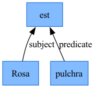
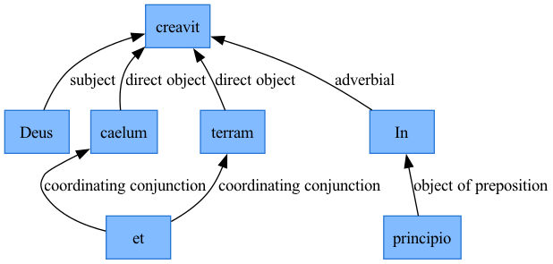
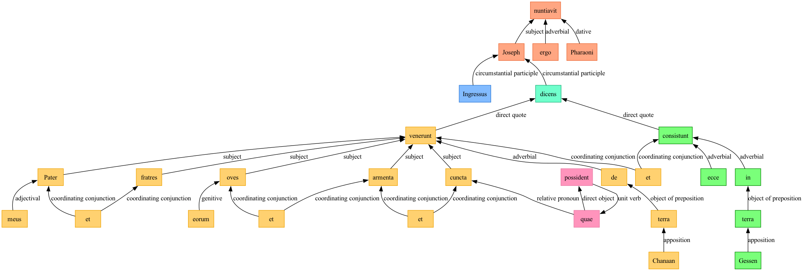

```{python}
#| echo: false
analysis_file = "../quarto/sample_data/rosa.cex"

from arsgrammatica import (
  read_analyses,
  split_analysis_by_sentence
)
tokengraph, verbalunits, sentences, lm_infos = read_analyses(analysis_file)
sentence_slices = split_analysis_by_sentence(tokengraph, verbalunits, sentences)

tokengraph, sentence_verbalunits = sentence_slices[0]
```


Once we have [analyzed a passage](./analysis.qmd), we can characterize the resulting syntax graph with standard graph metrics. `arsgrammatica` includes functions for analyzing graphs in Python, and a Marimo notebook, `latin_syntaxer_graphs.py`, where you can interactively explore some of these metrics.

## Finding graph metrics

Assume that we've created or loaded a token graph into the variable `tokengraph`. We first create a graph in the format of the Python NetworkX package, then compute graph metrics directly from the NetworkX graph:

```{python}
from arsgrammatica import tokengraph_to_networkx, graph_metrics
nxgraph, warnings = tokengraph_to_networkx(tokengraph)
metrics = graph_metrics(nxgraph)
```


::: {.callout-note}
Like the diagramming utilities for visualizing graphs in [Mermaid](./mermaid.qmd) or [`graphviz`](../tutorials/diagrams.qmd), `arsgrammatica` ignores punctuation tokens in these metrics.
:::


## An example graph

The resulting variable `metrics`  has a number of properties that  can help us understand the size, complexity, and "shape" of the syntax analysis' graph structure. Let's illustrate those metrics with a minimal Latin sentence: *Rosa pulchra est.* We could visualize its graph like this:



## Size


`node_count` and `edge_count` properties tell us the number of tokens and the number of relations connecting tokens in our syntax graph. If the graph is not cyclic, `longest_chain` tells us the deepest level of token relations in the sentence. `longest_chain` is `None` when a a graph includes a cycle. 

```{python}
metrics.node_count
```

```{python}
metrics.edge_count
```

```{python}
metrics.longest_chain
```

Compare the diagram of the graph with these results: node count of 3, edge count of 2, and a longest chain of 1.


## "Shape" (topology)  

`leaf_count` tells you the number of tokens that no other tokens depend on (the "leaves" in a tree visiualization). `leaf_fraction` gives you the proportion of nodes in the graph that are leaf nodes. 


```{python}
metrics.leaf_count
```


```{python}
metrics.leaf_fraction
```

In the toy example, two nodes are leaf nodes (*Rosa* and *pulchra*), and the leaf fraction is 2/3.


The example syntax graph is a *tree*: every node is connected and there are no cycles or loops in the graph. Most syntax graphs come close to a tree structure, but tokens like relative pronouns (that are related both to their antecedent and to their function in the relative clause) can create cycles.  The `cyclomatic_number` gives a measure of "how much non-tree structure does this sentence have?" (More techncially, it gives the number edges beyond a spanning tree, computed as `edge_count - node_count + weakly_connected_components`). The cyclomatic number in this example is 0, because the entire graph is a true tree.


```{python}
metrics.cyclomatic_number
```

## Organization of the graph

`arsgrammatica`'s syntax graphs are *directed*:  pairs of nodes are connected *from* one node *to* another (e.g., the *subject* relationship makes a connection *from* a subject *to* its verb). For any node, the *in-degree* is the number of relations point *to* it, and the *out-degree*  is the number of relations it points out to. In the example above, *est* has an in-degree of 2, and an out-degree of 0.

The `mean_dependents` and `max_dependents` measure the average and maximum in-degree of the graph. If a sentence has a high maximum compare to its node count, that tells us one token controls most of the syntax. Lower values with mean and maximum closer to each other suggests a "shallow and bushy" structure rather than a "deep and chainy" organization.


## Real examples

To illustrate how graph metrics can describe syntax, compare the toy example with two sentences from the Latin Vulgate Bible. *Genesis* 1.1, *In principio creavit Deus caelum et terram.* is a syntactically straightforward sentence with a single verbal unit:




*Genesis* 47.1 is much more complex syntactically: circumstantial participles include *dicens* introducing two clauses in direct speech.

*Ingressus ergo Joseph nuntiavit Pharaoni, dicens: Pater meus et fratres, oves eorum et armenta, et cuncta quae possident, venerunt de terra Chanaan: et ecce consistunt in terra Gessen.*




::: {.callout-tip}
If the diagram is too small to read, open it in a separate browser tab or window to enlarge it.
:::

Here are the metrics for each example:

| metric| Example | *Genesis* 1.1| *Genesis* 47.1 | 
| --- | ---| --- | --- |
| node count | 3 | 7 | 54 |
| edge count | 2 | 7 | 59 |
| cyclomatic number | 0 | 1 | 8 |
| longest chain | 1 | 2 | - |
| leaf count | 2 | 3 | 21 |
| leaf fraction | 67% | 43% | 39% |
| mean dependents | 0.67 | 1.0 | 4 |
| max dependents | 2 | 1.09| 7 |


Finally we should note that the output of `graph_metrics` also has a `relationship_counts` property. This property is a dictionary giving the counts of each value of relationship. Here is what the `relationship_counts` property looks like for *Genesis* 1.1:

```
{'adverbial': 1, 'object of preposition': 1, 'subject': 1, 'direct object': 2, 'coordinating conjunction': 2}
```

and for *Genesis* 47.1:

```
{'circumstantial participle': 2, 'adverbial': 6, 'subject': 8, 'dative': 1, 'adjectival': 6, 'coordinating conjunction': 12, 'genitive': 4, 'relative pronoun': 2, 'direct object': 4, 'unit verb': 2, 'direct quote': 4, 'object of preposition': 3, 'apposition': 4, 'predicate': 1}
```


## `latin_syntaxer_graphs.py`

With the `latin_syntaxer_graphs.py` marimo notebook, you can apply these graph metrics to saved analyses. The user picks one or more sentences to analayze, and the compiles tables comparing their metrics.


